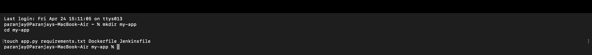
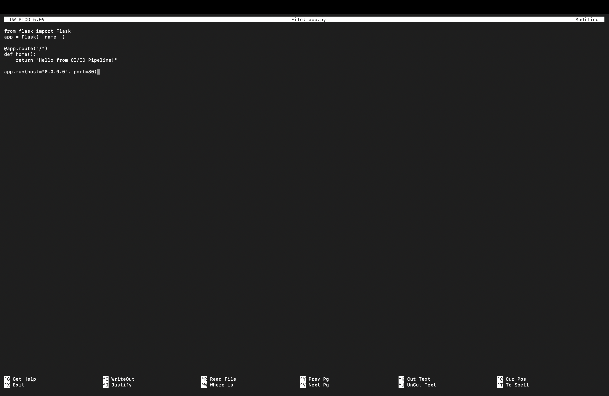
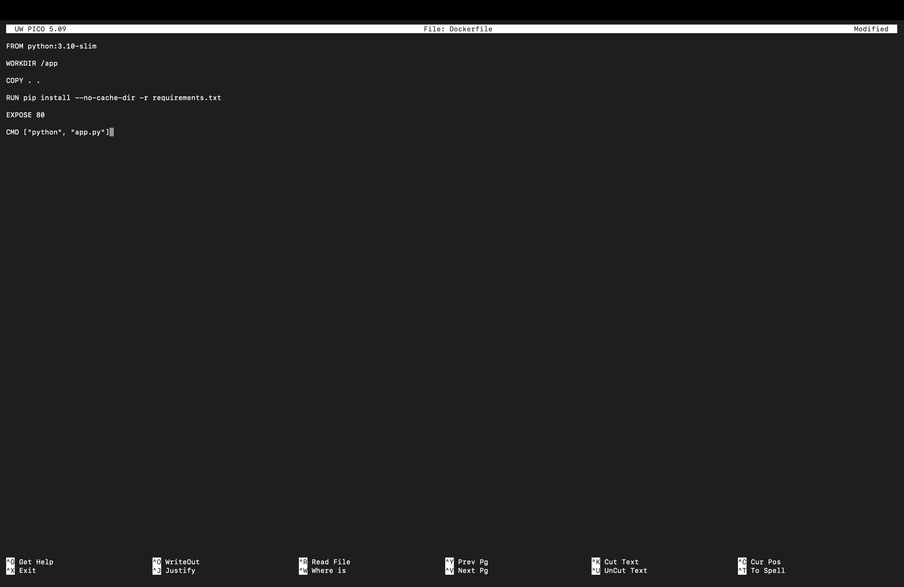
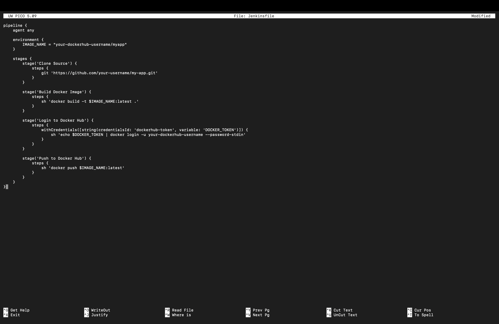
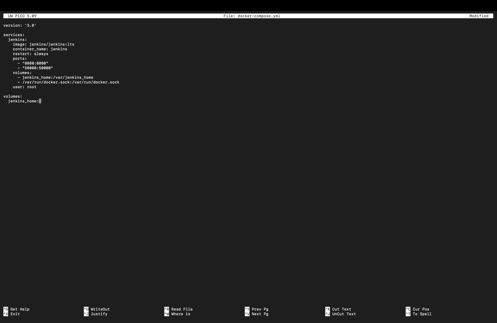
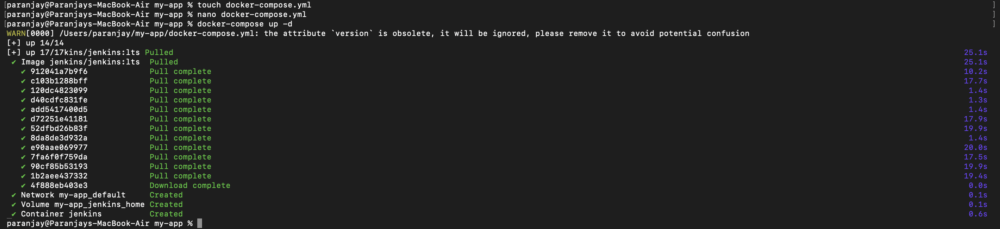
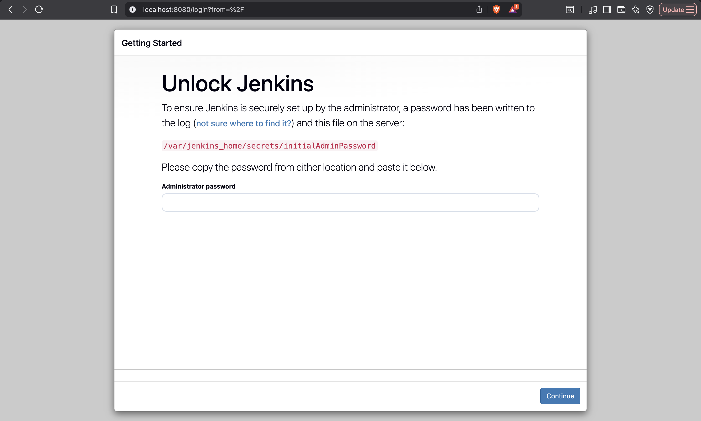
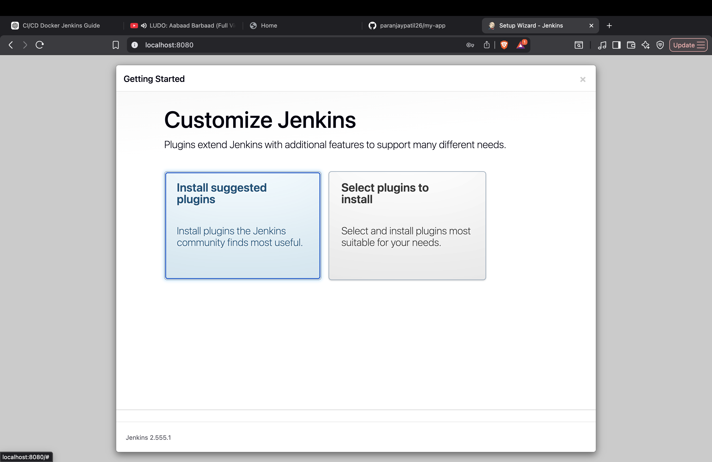
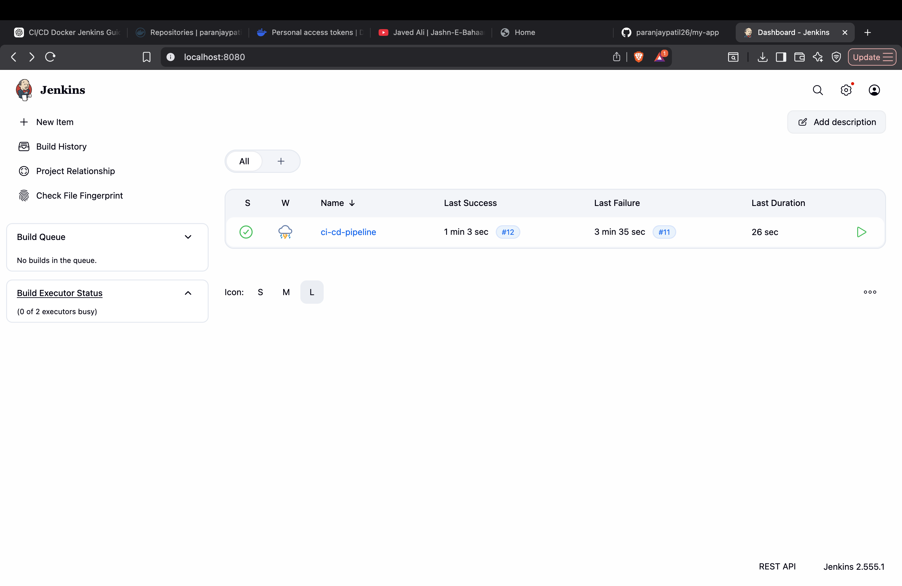

# Experiment 7: CI/CD Pipeline using Docker and Jenkins

---

## Aim

To build and deploy a Flask application using Docker and automate the process using a Jenkins CI/CD pipeline.

---

## System Details

* Operating System: macOS
* Tools Used: Docker, Jenkins
* Language: Python (Flask)

---

## Project Structure

```
my-app/
├── app.py
├── requirements.txt
├── Dockerfile
├── Jenkinsfile
├── docker-compose.yml
```

---

## Application Code

### app.py

```python
from flask import Flask
app = Flask(__name__)

@app.route("/")
def home():
    return "Hello from CI/CD Pipeline!"

app.run(host="0.0.0.0", port=80)
```

---

### Dockerfile

```dockerfile
FROM python:3.10-slim

WORKDIR /app

COPY . .

RUN pip install --no-cache-dir -r requirements.txt

EXPOSE 80

CMD ["python", "app.py"]
```

---

### Jenkinsfile

```groovy
pipeline {
    agent any

    environment {
        IMAGE_NAME = "your-dockerhub-username/myapp"
    }

    stages {
        stage('Clone Source') {
            steps {
                git 'https://github.com/your-username/my-app.git'
            }
        }

        stage('Build Docker Image') {
            steps {
                sh 'docker build -t $IMAGE_NAME:latest .'
            }
        }

        stage('Login to Docker Hub') {
            steps {
                withCredentials([string(credentialsId: 'dockerhub-token', variable: 'DOCKER_TOKEN')]) {
                    sh 'echo $DOCKER_TOKEN | docker login -u your-dockerhub-username --password-stdin'
                }
            }
        }

        stage('Push to Docker Hub') {
            steps {
                sh 'docker push $IMAGE_NAME:latest'
            }
        }
    }
}
```

---

### docker-compose.yml

```yaml
version: '3.8'

services:
  jenkins:
    image: jenkins/jenkins:lts
    container_name: jenkins
    restart: always
    ports:
      - "8080:8080"
      - "50000:50000"
    volumes:
      - jenkins_home:/var/jenkins_home
      - /var/run/docker.sock:/var/run/docker.sock
    user: root

volumes:
  jenkins_home:
```

---

## Implementation Steps

### Step 1: Create Project Files

```bash
mkdir my-app
cd my-app
touch app.py requirements.txt Dockerfile Jenkinsfile docker-compose.yml
```



---

### Step 2: Write Flask Application



---

### Step 3: Create Dockerfile



---

### Step 4: Create Jenkins Pipeline



---

### Step 5: Configure Docker Compose



---

### Step 6: Start Jenkins

```bash
docker-compose up -d
```



---

### Step 7: Open Jenkins

Visit:

```
http://localhost:8080
```



---

### Step 8: Install Plugins



---

### Step 9: Run Pipeline



---

## Result

The Flask application was successfully built and deployed using a Jenkins CI/CD pipeline.

---

## Conclusion

This experiment demonstrates how Docker and Jenkins can be used together to automate application deployment and improve development workflows.

---
